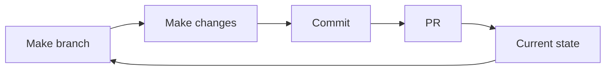

# Sully's README

## The idea

Keeping everything on paper in a private GitHub repo serves several tasks at
once:

- Provides a way to keep everything down on paper:
  - General line management
  - Task delegation and status
  - Learnings/notes (e.g., 1:1 meeting notes)
  - Feedback
  - Examples of things in code
- Gives some practice: with
  - working with `git`
  - collaborating on code
  - `markdown`, which we use a lot
- Always have access to change things
- Flexible:
  - doesn't need immediate action so can work into day(s)
  - Can be changed to whatever kind of format works best:
    - One central document with everything
    - Folders by project
    - Any other kind of arrangement you like!
- Software agnostic: you only need a text editor and `git`

## Process

The idea is that if you make changes you do the process, then upon review the
other person can observe the changes made.

This lets you instantly see which tasks have been done, which have been added,
amendments to other things. Fast clean reliable.

## Working days

Monday, Wednesday, Thursday to match up with the internal meetings at
DPA

## Objectives

Just a rough list of general objectives at the moment!

- Learn the ropes!
- Get 1:1s with everybody to help get settled
- Finish all of the DPA courses
- Upskill in the use of `R`
- Figure out project management with GitHub
- Help me with project work!

